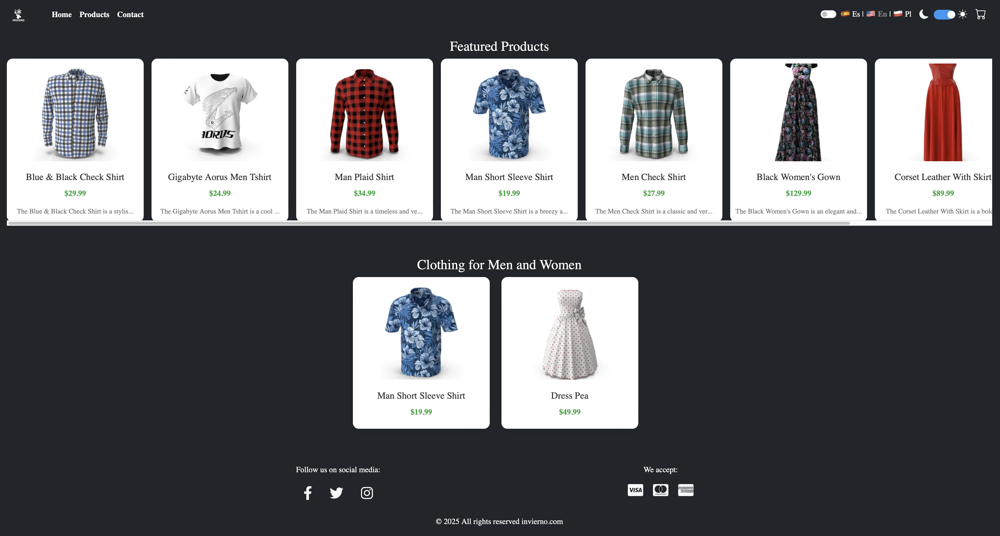

 🛍️ Invierno Shop 

Invierno Shop es una SPA (Single Page Application) de tienda en línea desarrollada con HTML5, Bootstrap 5.3 y JavaScript Vanilla. Permite explorar productos desde una API externa, cambiar el idioma del sitio, agregar productos al carrito y simular una compra, todo sin necesidad de recargar la página.

 🌐 Demo en Vivo

🔗 [https://invierno-shop.vercel.app/](https://invierno-shop.vercel.app/)

🚀 Características

• 🌍🌍 Selector de idioma: Español, Inglés y Polaco, con preferencia guardada en el navegador.

• 🛒 🛒 Carrito funcional: Sumar/restar productos, eliminar, mostrar total y botón de pago simulado.

• 🧺 Productos por categoría: Ropa para hombre y mujer, cargada dinámicamente desde la API.

• 📱 Diseño responsive: Interfaz adaptable a móviles, tablets y escritorio.

•  ⚡ SPA rápida: Navegación fluida sin recargar la página.

🧑‍💻 Tecnologías Utilizadas

• HTML5
• Bootstrap 5.3 (CDN)
• JavaScript Vanilla (sin ES6+)
• DummyJSON API
• Vercel (deploy)

🌐 Idiomas Disponibles

• 🇪🇸 Español
• 🇬🇧 Inglés
• 🇵🇱 Polaco

📸 Captura de Invierno Shop

